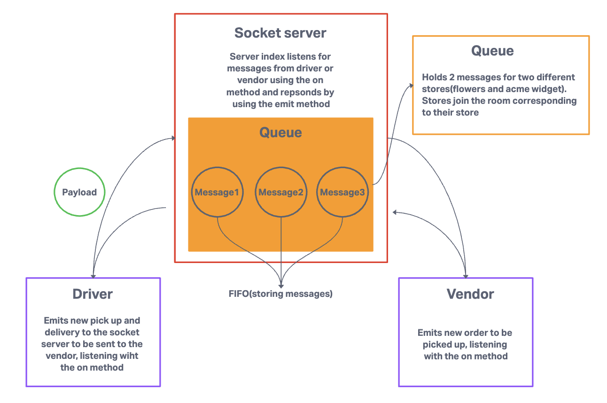

# LAB - 11-13

## Author: Tricia Sawyer

### Problem Domain

CAPS

- Events((PR:class-01)lab 11)
This is the first of a 4-Phase build of the CAPS system, written in Node.js. In this first phase, our goal is to setup a pool of events and handler functions, with the intent being to refactor parts of the system throughout the week, but keep the handlers themselves largely the same. The task of “delivering a package” doesn’t change (the handler), even if the mechanism for triggering that task (the event) does.

User stories:

- As a vendor, I want to alert the system when I have a package to be picked up.
- As a driver, I want to be notified when there is a package to be delivered.
- As a driver, I want to alert the system when I have picked up a package and it is in transit.
- As a driver, I want to alert the system when a package has been delivered.
- As a vendor, I want to be notified when my package has been delivered.

- Socket.IO(PR 2, lab 12)
In Phase 2, we’ll be changing the underlying networking implementation of our CAPS system from using node events to using a library called Socket.io so that clients can communicate over a network. Socket.io manages the connection pool for us, making broadcasting much easier to operate, and works well both on the terminal (between servers) and with web clients.

Developer story changes:
As a developer, I want to create network event driven system using Socket.io so that I can write code that responds to events originating from both servers and client applications.

- Queue(PR 3, lab 13)
In Phase 3, we are building a set of features to help manage deliveries made by CAPS Drivers. This will simulate a delivery driver receiving a list of orders from a Queue and “scanning” package codes on delivery. Retailers will be able to see in their dashboard or log, a list of all packages delivered in real time. Should a delivery driver deliver any packages while the retailer is not connected to the dashboard, the vendor client should be guaranteed to receive “delivery” notifications from the Queue system.

User stories:

- As a vendor, I want to “subscribe” to “delivered” notifications so that I know when my packages are delivered.
- As a vendor, I want to “catch up” on any “delivered” notifications that I might have missed so that I can see a complete log.
- As a driver, I want to “subscribe” to “pickup” notifications so that I know what packages to deliver.
- As a driver, I want to “catch up” on any “pickup” notifications I may have missed so that I can deliver everything.
- As a driver, I want a way to “scan” a delivery so that the vendors know when a package has been delivered.

### Links and Resources

- [GitHub Actions ci/cd]
[Emit cheatsheet](https://socket.io/docs/v3/emit-cheatsheet/)

### Collaborators

- Code review in lecture using Reece's code
- Worked in Remo with Daniel and Stephen on code and test issues

### Setup

.env requirements (where applicable)
for now I have none and do not require one

How to initialize/run your application (where applicable)
e.g. npm start

#### Tests

to run tests, after running `npm i`, run the command `npm test`

#### Deployed version

[Render deploy](https://caps-dev.onrender.com)

#### UML

